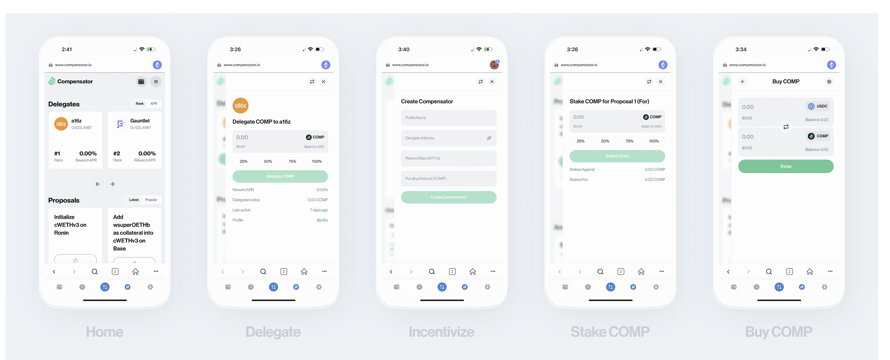

<p align="center">
  
</p>

## Contract Addresses

| Name       | Address       |
| -------------  | ------------- |
| Compensator Factory      | [#](https://etherscan.io/address/#) |
| Compound (COMP)    | [0xc00e94Cb662C3520282E6f5717214004A7f26888](https://etherscan.io/address/0xc00e94Cb662C3520282E6f5717214004A7f26888) |

## Overview
Compensator is a dedicated delegate marketplace for the Compound DAO, designed to address low voter turnout and lack of incentivization in governance. It enables COMP holders to delegate COMP in exchange for transparent rewards, fostering greater participation in governance. Delegates attract COMP through competitive rates, creating a vibrant and efficient ecosystem focused on delegation and reward distribution.

## Core Features

### **Factory-Based Delegation System**
- **CompensatorFactory** deploys individual **Compensator** contracts for each user
- Each user gets their own **Compensator** instance for personalized delegation
- Factory tracks all deployed compensators and owner mappings
- Users can create compensators for themselves or others

### **Delegation and Rewards**
- Delegates supply COMP into their `Compensator` contract to fund rewards for delegators
- Delegates set a reward rate (in COMP/second) to distribute rewards proportionally
- COMP holders delegate COMP tokens to the delegate's `Compensator` contract
- Delegators earn rewards based on their share of delegated COMP
- **Index-based reward distribution** ensures fair and accurate reward calculation
- **Time-based accrual** with proportional delegation distribution

### **Reward Distribution System**
- Delegators earn rewards based on their share of delegated COMP
- **Index-based reward distribution** ensures fair and accurate reward calculation
- **Time-based accrual** with proportional delegation distribution
- Rewards are distributed continuously based on the delegate's set rate

See [Protocol Specs](https://github.com/camconrad/compensator/blob/main/contracts/README.md) for more detail.

## User Workflow

### For Delegates
1. **Create Compensator**: Call `CompensatorFactory.createCompensatorForSelf()` to deploy your contract
2. **Supply COMP**: Supply COMP into your `Compensator` contract to fund delegator rewards
3. **Set Reward Rate**: Define the reward rate (in COMP per second) to distribute rewards
4. **Manage Rewards**: Monitor and adjust reward distribution as needed
5. **Withdraw COMP**: Withdraw unused COMP as needed (pending rewards reserved)

### For Delegators
1. **Find a Delegate**: Browse available delegates and their reward rates
2. **Delegate COMP**: Delegate COMP tokens to a delegate's `Compensator` contract to start earning
3. **Monitor Rewards**: Track your accrued rewards and delegate performance
4. **Claim Rewards**: Claim your proportionally accrued COMP rewards at any time
5. **Withdraw COMP**: Withdraw your delegated COMP tokens when desired

## Development

### Setup
```bash
npm install
npx hardhat clean
npx hardhat compile
```

### Local Development
```bash
# Start local network
npx hardhat node

# Deploy contracts locally
npx hardhat run scripts/deploy.ts --network localhost
```

## Testing

### Test Architecture

```
test/
├── core/                    # Core functionality tests
│   ├── compensator/        # Main Compensator contract tests
│   │   ├── delegate-functions.test.js    # Delegation & rewards
│   │   ├── views.test.js                 # View functions & data retrieval
│   │   ├── factory.test.js               # Factory operations & management
│   │   ├── security.test.js              # Access control & security
│   │   ├── performance.test.js           # Performance benchmarking
│   │   └── gas-optimization.test.js      # Gas usage & optimization
│   └── factory/            # CompensatorFactory tests
├── invariants/             # Critical system property tests
├── fuzzing/                # Property-based and edge case tests
├── integration/            # End-to-end system workflows
├── edge-cases/             # Boundary condition tests
├── mocks/                  # Mock contract implementations
├── fork/                   # Mainnet forking tests
├── helpers/                # Test utility classes
├── gas-reports/            # Gas usage analysis
└── main.js                 # Main test runner

### 📁 Fake Contracts Architecture
The project includes sophisticated fake contracts in `contracts/fakes/` for advanced testing scenarios:
- **`CompensatorFake.sol`** - Full-featured fake with realistic behavior and edge case simulation
- **`ERC20Fake.sol`** - Configurable ERC20 token for testing various scenarios  

These contracts are compiled by Hardhat and available as TypeScript types and factory contracts for comprehensive testing.

```

### Test Categories & Coverage

| Category | Tests | Status | Description |
|----------|-------|---------|-------------|
| **Core Tests** | 30 | ✅ | Delegate functions, views, factory operations |
| **Invariants** | 12 | ✅ | System properties and mathematical consistency |
| **Fuzzing** | 7 | ✅ | Property-based testing with random inputs |
| **Integration** | 7 | ✅ | End-to-end system workflows |
| **Edge Cases** | 11 | ✅ | Boundary conditions and error handling |
| **Mock Contracts** | 35 | ✅ | ERC20 mocks |
| **Factory Tests** | 16 | ✅ | Factory deployment and management |
| **Views Tests** | 15 | ✅ | Contract view functions |
| **Security Tests** | 3 | ✅ | Access control and security |
| **Performance Tests** | 2 | ✅ | Benchmarking and optimization |
| **Gas Tests** | 6 | ✅ | Gas usage tracking and regression |
| **Fork Tests** | 5 | ✅ | Mainnet forking and real contracts |

**Total: 157 tests** 🎉

### Running Tests

#### Run All Tests
```bash
npx hardhat test
```

#### Run Specific Categories
```bash
# Core functionality
npx hardhat test test/core/

# Security and invariants
npx hardhat test test/invariants/

# Property-based testing
npx hardhat test test/fuzzing/

# End-to-end workflows
npx hardhat test test/integration/

# Edge cases and boundaries
npx hardhat test test/edge-cases/

# Mock implementations
npx hardhat test test/mocks/

# Mainnet forking
npx hardhat test test/fork/
```

#### Advanced Test Options
```bash
# Run with gas reporting
REPORT_GAS=true npx hardhat test

# Generate coverage report
npx hardhat coverage

# Run specific test file
npx hardhat test test/core/compensator/delegate-functions.test.js

# Run with verbose output
npx hardhat test --verbose
```

### 🔧 Test Infrastructure

#### **Core Utilities**
- **`TestBase.js`** - Contract deployment and setup
- **`TestUtils.js`** - Common testing utilities
- **`Constants.js`** - Test constants and configuration

#### **Advanced Frameworks**
- **`AdvancedSecurityTester.js`** - Security testing framework
- **`PerformanceBenchmarker.js`** - Performance benchmarking
- **`GasRegressionDetector.js`** - Gas optimization tracking
- **`ForkTestBase.js`** - Mainnet forking utilities

#### **Mock & Fake Contracts**
- **`MockERC20.sol`** - Simulates COMP token functionality
- **`CompensatorFake.sol`** - Advanced testing contract (located in `contracts/fakes/`)
- **`ERC20Fake.sol`** - Fake ERC20 for testing (located in `contracts/fakes/`)

### 🎯 Key Testing Features

#### **Security Testing**
- Access control verification
- Reentrancy protection
- Input validation
- Vulnerability assessment
- Ownership transfer synchronization
- Token transfer prevention

#### **Performance Testing**
- Gas usage tracking
- Regression detection
- Benchmark comparisons
- Optimization analysis
- Branch coverage analysis

#### **Advanced Testing**
- Property-based testing (fuzzing)
- Invariant verification
- Integration workflows
- Real contract interactions
- Mainnet forking validation

#### **Professional Infrastructure**
- Sophisticated fake contracts
- Comprehensive mock implementations
- Automated test frameworks
- Detailed reporting and analysis

### 🏆 Test Results

**All 157 tests pass successfully** with comprehensive coverage across:
- Core contract functionality
- Security mechanisms
- Performance characteristics
- Edge cases and boundaries
- Integration scenarios
- Real-world conditions

### 🚨 Test Validation Checklist

For reviewers, each test category validates:

#### ✅ Core Functionality
- [ ] Contract deployment and initialization
- [ ] COMP token delegation and management
- [ ] Reward calculation and distribution
- [ ] Reward rate management
- [ ] Factory operations and management

#### ✅ Security Measures
- [ ] Access control validation
- [ ] Reentrancy protection
- [ ] Input validation and sanitization
- [ ] Ownership transfer synchronization
- [ ] Token transfer prevention
- [ ] Withdrawal limit enforcement

#### ✅ Edge Cases & Boundaries
- [ ] Zero amount operations
- [ ] Boundary conditions
- [ ] Error scenarios and exceptions
- [ ] Gas optimization and limits
- [ ] State transition validation
- [ ] Cross-function interactions

#### ✅ Performance & Quality
- [ ] Gas usage optimization
- [ ] Performance benchmarking
- [ ] Regression detection
- [ ] Memory efficiency
- [ ] Computational complexity

## Future Improvements
- **Multi-Chain Support**: Allow delegates and delegators to effectively interact from desired chains
- **Reward Redirection**: Allow delegators to redirect their rewards to the delegate as a form of support
- **Gas Optimization**: Further optimize gas usage for reward calculations and delegator interactions
- **Advanced Analytics**: Enhanced delegate performance metrics and analytics

## Acknowledgments
Many thanks to long-time Compound community member [Mike Ghen](https://github.com/mikeghen), who created this concept and won a hackathon grant for it from Compound 2 years ago. We also thank Compound contributors heading the grants program, who've allowed Compensator to be furthered and surfaced in the community. Lastly, we thank the Compound community as a whole for the opportunity to drive greater outcomes for Compound.